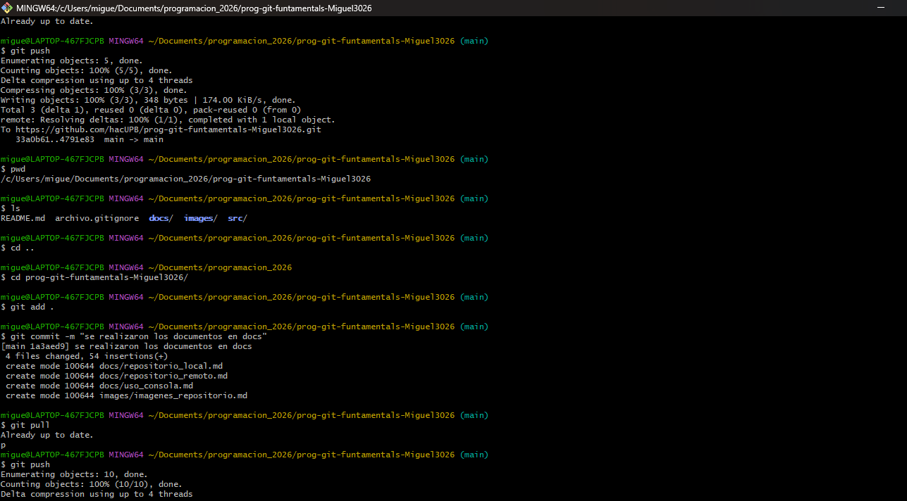
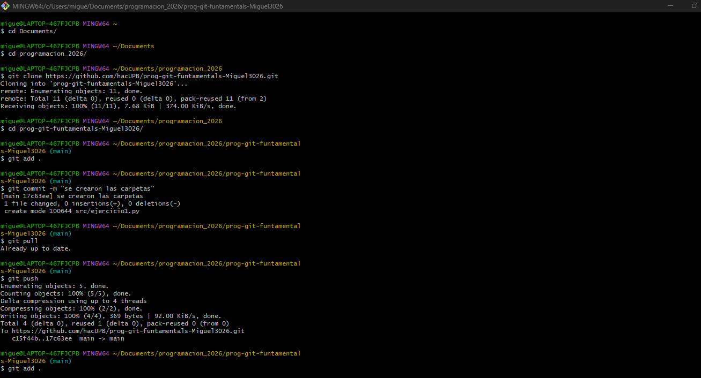

# Uso de la consola para navegar y crear directorios y archivos

## Navegación por directorios

La consola permite moverse entre carpetas del sistema usando comandos específicos. Esto permite localizar archivos y organizar 

diferentes proyectos.
Comandos utilizados para la navegación:

- **pwd**: muestra la ruta del directorio actual.
- **ls**: lista los archivos y carpetas del directorio actual.
- **cd nombre_directorio**: permite entrar a un directorio.
- **cd ..**: regresa al directorio anterior.

## Creación de directorios y archivos

Comandos:

- **mkdir nombre_carpeta**: crea un nuevo directorio.
- **touch archivo.txt**: crea un archivo vacío.

## Gestión de archivos y carpetas

La consola permite borrar, mover y copiar archivos de manera rápida.

Comandos aprendidos:

- **rm archivo**: elimina un archivo.
- **rm -r carpeta**: elimina una carpeta y su contenido.

## Listado de comandos

* **pwd**
* **ls**
* **cd**
* **mkdir**
* **touch**
* **rm**
* **clear**

## Imagenes: 

